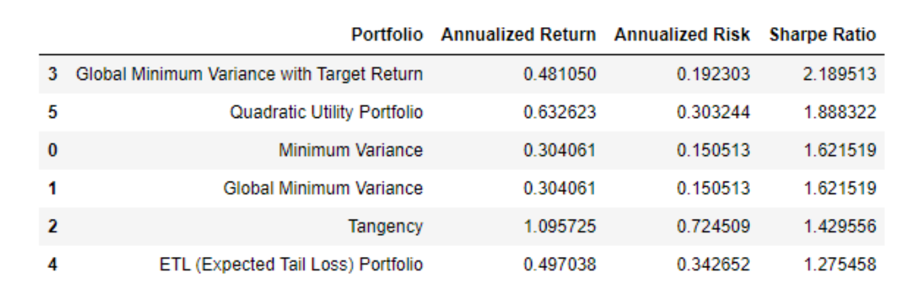

# Portfolio Building Small and Mid Cap Stocks for Optimal Returns

## Summary:

This repository provides a comprehensive analysis of portfolio construction for a client aiming to maximize returns within a 12-month timeframe. The focus is on selecting stocks from the small and mid-cap sectors, leveraging insights from high-performing mutual fund portfolios.

## Key Aspects:

1. **Client Objective**: Maximizing **short-term wealth** with a focus on a **12-month investment horizon**.
2. **Stock Selection**: Stocks chosen from **small** and **mid-cap sectors** for **rapid growth potential**.
3. **Number of Stocks**: A diversified portfolio of **48 stocks**, with **25 potential stocks** identified based on their **Sharpe ratio**.
4. **Stock Analysis**: Each stock is evaluated based on **past performance** and **sector representation**.

---

## Methodology:

The portfolio construction employs a variety of methods to optimize returns and manage risk, including:

- **Equal Weighted Portfolio**
- **Minimum Variance Portfolio**
- **Global Minimum Variance Portfolio (GMVP)**
- **Minimum Variance Portfolio with Target Return**
- **Efficient Portfolio with Target Returns**
- **Tangency Portfolio**
- **Maximum Return Portfolio with Target Risk Level**
- **Efficient Frontier Portfolio**
- **ETL (Expected Tail Loss) Portfolio**
- **Quadratic Utility Portfolio**

Each method is carefully explained, detailing its approach, stock weight allocation, and conclusion to aid in portfolio construction.

---
## Sample Method : Global Minimum Variance Portfolio (GMVP)

### A. What is the method?

The **Global Minimum Variance Portfolio (GMVP)** is an extension of the **Minimum Variance Portfolio** concept. Its goal is to find the portfolio with the **lowest possible variance**, without targeting a specific return. The GMVP lies at the lowest point of the **efficient frontier** in modern portfolio theory, representing the optimal risk-minimized portfolio.

### B. What does it do during portfolio building?

When constructing the GMVP, the process involves calculating the **expected returns**, **variances**, and **covariances** of all assets in the portfolio. Optimization algorithms are then used to determine the **weights** of each asset, with the goal of minimizing overall portfolio variance. This often results in a concentrated portfolio, particularly when a few assets exhibit significantly lower volatility than the others.

### C. Weight Output and Stock Names with Weights:

In a GMVP, stocks with historically **low volatility**, such as **SJVN** or **Cipla**, may receive higher weights, reflecting their contribution to **risk reduction**. For our portfolio, the weight output shows that stocks like **SJVN**, **CIPLA**, and **MPHASIS** carry significant weights, emphasizing their role in minimizing risk. The GMVP weight distribution aligns with the **Minimum Variance Portfolio (Method 3)**, confirming that the GMVP for these stocks is essentially the same as the **Minimum Variance Portfolio** in this case.

### D. Return and Risk:

- **GMVP Annualized Return**: 24.43%
- **GMVP Annualized Risk (Standard Deviation)**: 14.89%
- **GMVP Sharpe Ratio**: 1.238

#### Key Metrics:
- **Return**: The average annual return expected from the portfolio. GMVP prioritizes **risk reduction** over return maximization.
- **Risk**: Represented by **annualized standard deviation**, indicating portfolio volatility. A lower value in GMVP suggests less exposure to large fluctuations.
- **Sharpe Ratio**: Measures excess return per unit of risk. A higher Sharpe Ratio indicates better **risk-adjusted return**. With a Sharpe Ratio of 1.238, GMVP is considered a strong, efficient portfolio in terms of risk management.

### E. Conclusion:

The **GMVP** is ideal for **risk-averse investors** who prioritize stability and wish to minimize risk. However, it may not perform as well during bull markets, where higher returns are sought. The similarity between **Method 2** and **Method 3** confirms that our optimization effectively targeted **low risk**, in line with GMVP principles. While the GMVP is a perfect fit for risk-averse investors, it may not suit those seeking higher returns or **diversified exposure**.

---
## Back Testing:

The portfolios underwent **historical backtesting** to evaluate **performance**, providing valuable insights into **risk**, **volatility**, and other key data for future investment decisions. The analysis explores various portfolio construction methods tailored to different **investor profiles** based on **risk** and **return**. Additionally, the **stock selection rationale** is provided to support short-term investment strategies.

### Backtesting of Manually Selected stocks

  

### Backtesting of Gen AI Selected stocks

  

---

## Key Results:

The primary outcome of the methodology is the selection of **48 stocks**, chosen for their **past performance** and their ability to contribute to a **diversified portfolio**. The portfolio construction methods applied include:

1. **Equal Weighted Portfolio**: Distributes equal weight to each stock for a balanced investment.
2. **Minimum Variance Portfolio**: Focuses on **minimizing risk** by selecting stocks with lower historical volatility.
3. **Global Minimum Variance Portfolio (GMVP)**: Aims to achieve the **lowest portfolio variance**.
4. **Minimum Variance Portfolio with Target Return**: Balances a **specific return** with **risk minimization**.
5. **Efficient Portfolio with Target Returns**: Optimizes **returns** for a given level of **risk**.
6. **Tangency Portfolio**: Maximizes the **Sharpe Ratio** to offer the best **risk-adjusted return**.
7. **Maximum Return Portfolio with Target Risk Level**: Seeks to maximize **returns** for a given **risk** level.
8. **Efficient Frontier Portfolio**: Utilizes the **efficient frontier** concept to balance **risk** and **return**.
9. **ETL (Expected Tail Loss) Portfolio**: Focuses on **managing extreme risks** in the portfolio.
10. **Quadratic Utility Portfolio**: Balances **risk aversion** and **return objectives** using a **quadratic utility function**.

Each method is analyzed for its **application**, **stock weight distribution**, and **effectiveness**, providing a comprehensive view of various investment strategies.

---
## Return Comparison and Comments:

The manually curated portfolio achieved a robust return of **56.71%**, driven by high-performing stocks like **POLYCAB** and **CIPLA**. In contrast, the GenAI-selected portfolio delivered a **11.30%** return, showcasing a balanced mix of sectors. Both approaches demonstrate successful investment strategies.
While the manual portfolio emphasized specific high-performing stocks, the GenAI-selected portfolio showcased a **balanced sectoral mix**, resulting in commendable returns. Both methods exhibit successful strategies, emphasizing the importance of tailored **stock selection** and **diversified sectoral allocation** in achieving positive investment outcomes.

#### My Portfolio Returns

  

### Gen AI Portfolio Returns

  

